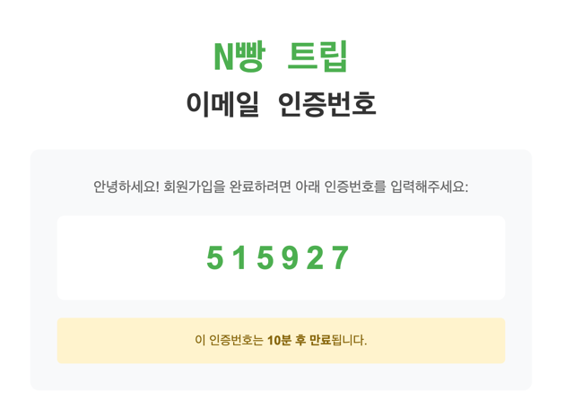
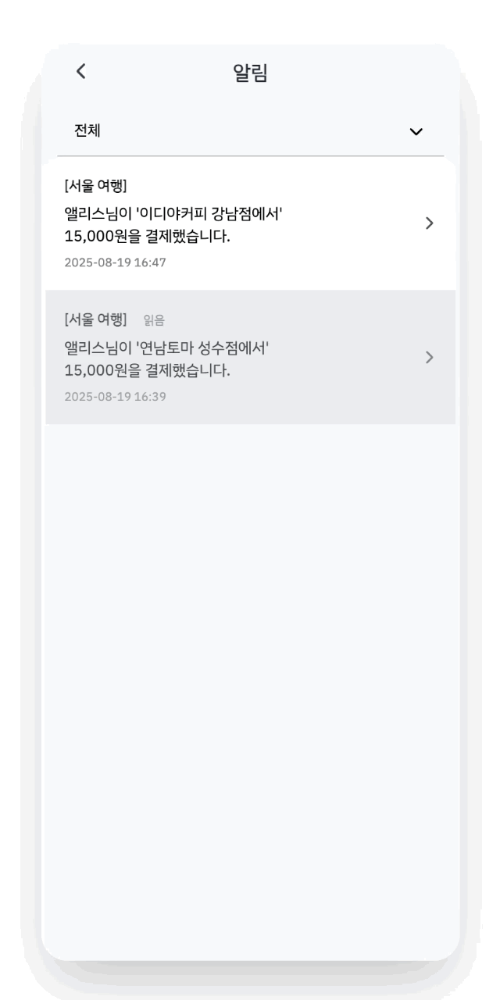

# N빵트립 🐱💳

**N빵트립**은 여행 그룹을 위한 **실시간 가계부**, **QR 결제**, **자동 상계 정산** 기능을 제공하는 올인원 여행 정산 플랫폼입니다. 
여행 중 발생하는 번거로운 비용 문제를 해결하기 위해 N빵트립을 만들었습니다. 
귀엽고 똑똑한 N빵트립의 마스코트 "**냥이**"와 함께라면, 복잡했던 여행 정산도 단 한 번의 클릭으로 끝낼 수 있습니다!  
지금부터 N빵 트립과 함께, 간편하고 투명한 여행 정산을 경험해 보세요! 🌍✨

  

---

## 🚩 프로젝트
> 진행 기간 : 2025.07.09. ~ 2025.08.21. (7주)
- **목표**: 여행 그룹 간의 번거로운 비용 정산 과정을 자동화하고, 실시간 소비 내역을 공유하여 **금융 생활의 편의성**을 제공합니다.
- **핵심 기능**: 여행 그룹 생성 및 관리, QR 결제, 선/기타 결제 등록, 자동 상계 정산
---

## 👥 팀원 소개

<table>
  <tr>
    <td align="center">
      
       <a href="https://github.com/githubID1"><b>김원영</b></a>
      <ul align="left">
        <li>팀장</li>
        <li>QR 결제(입력)</li>
        <li>가맹점 QR</li>
      </ul>
    </td>
    <td align="center">
      
       <a href="https://github.com/githubID2"><b>이지아</b></a>
      <ul align="left">
        <li>백엔드 팀장</li>
        <li>정산 상태 처리</li>
        <li>그룹원 간 다중 송금</li>
      </ul>
    </td>
    <td align="center">
      
       <a href="https://github.com/githubID3"><b>이혜미</b></a>
      <ul align="left">
        <li>프론트엔드 팀장</li>
        <li>그룹 결제 내역 관리</li>
        <li>결제 내역 수정 및 삭제</li>
      </ul>
    </td>
  </tr>
  <tr>
    <td align="center">
      
       <a href="https://github.com/githubID4"><b>권혁주</b></a>
      <ul align="left">
        <li>메인 홈</li>
        <li>푸시 알림</li>
      </ul>
    </td>
    <td align="center">
      
       <a href="https://github.com/githubID5"><b>김승욱</b></a>
      <ul align="left">
        <li>여행 관리</li>
        <li>그룹 관리</li>
      </ul>
    </td>
    <td align="center"> 
      
       <a href="https://github.com/githubID6"><b>이건우</b></a>
      <ul align="left">
        <li>정산 계산</li>
        <li>선/기타 결제 등록</li>
        <li>UI 구조 설계</li>
      </ul>
    </td>
  </tr>
  <tr>
    <td align="center">
      
       <a href="https://github.com/githubID7"><b>이민호</b></a>
      <ul align="left">
        <li>여행 리포트</li>
        <li>결제 내역</li>
      </ul>
    </td>
    <td align="center">
      
       <a href="https://github.com/githubID8"><b>이은솔</b></a>
      <ul align="left">
        <li>QR 결제(송금)</li>
        <li>선/기타 결제 등록 및 수정</li>
      </ul>
    </td>
    <td align="center">
      
       <a href="https://github.com/githubID9"><b>주수빈</b></a>
      <ul align="left">
        <li>JWT 기반 인증·인가</li>
        <li>회원/계좌 관리</li>
        <li>마이페이지</li>
      </ul>
    </td>
  </tr>
</table>

---

## 🛠 기술 스택

### 💻 Frontend

  
  
  
  
  
  

### 🖥 Backend

  
  
  
  

### 🗄 Database & Infra

  
  
  
  

### 🎨 Design

  
  

### 📡 Communication & Collaboration

  
  
  
  

---

## 🎯 주요 기능

### 1. 로그인/회원가입
- **Spring Security** + **JWT** 기반 인증 : Bcrypt 비밀번호 암호화 저장
- 개인정보 보호 : 이용 약관 동의, 개인 정보 수집·이용 동의, 마이데이터 수집·활용 동의, 푸시알림 수신 동의
- 닉네임/이메일 중복 검증, **이메일 인증 (Gmail SMTP)** : 인증번호 발급 및 제한 시간 내 검증 로직으로 보안 강화

  

  

### 2. 홈 화면
- 로그인 성공 후 메인 홈 화면 진입
- **미정산 내역**, **진행 중인 여행 그룹 현황**, **알림**, **여행지 추천**을 한눈에 확인 가능

  

### 3. 여행 그룹 관리
- **그룹 CRUD** : 생성 / 참여 / 탈퇴 / 수정 지원
- 그룹 정보 관리 : 그룹원 목록·상태, 여행 이름, 기간 수정 가능
- 권한 관리 : 그룹장 / 일반 사용자 역할 부여
- **Spring REST API** 기반 구현

  

### 4. 선결제 관리
- 그룹 내 선결제 내역 등록 (숙박, 교통, 예약 등)
- 결제 참여자 선택 가능

  

### 5. QR 결제
- 가맹점 QR 스캔 → 결제 금액 직접 입력 및 참여자 지정 → 결제
- **계좌 연동 결제** : 사용자 계좌와 연결하여 간편 송금
- **자동 내역 기록** : 결제 완료 즉시 해당 여행 그룹 가계부에 반영

  

### 6. 자동 상계 정산
- **계좌 연동** : 회원가입 시 등록한 계좌 기반으로 처리
- **투명성 보장** : 모든 송금 내역은 여행 그룹 가계부에 기록
- **상계 방식** : 단순 송금이 아닌 **상계 정산 알고리즘**을 적용하여 최소 송금 횟수로 정산
 

  

### 7. AI 리포트
- **OpenAI API** 연동: 여행 종료 시, 소비 내역을 분석하여 자동 리포트 생성
- 주요 분석 지표 : 총 지출, 카테고리별 소비
- 여행 요약 메시지 생성: “이번 여행에서 교통비가 많았습니다.” 와 같은 직관적인 **요약 메시지 제공**

  

### 8. 푸시 알림
- **Firebase Cloud Messaging(FCM)** 연동
- 알림 이벤트 : 그룹 초대, 결제 발생, 정산 완료, 알림 메시지 등
- 멀티 플랫폼 지원 : 앱/웹 브라우저 환경 모두에서 수신 가능

  

---

## 🗣️ 커밋 규칙

| 태그        | 의미                                                                  |
|-------------|-----------------------------------------------------------------------|
| `feat`      | 새로운 기능 추가                                                      |
| `fix`       | 버그 수정                                                             |
| `docs`      | 문서 관련 수정 (README, 주석 등)                                     |
| `test`      | 테스트 코드 추가 또는 수정                                            |
| `refactor`  | 코드 리팩토링 (기능 변화 없음)                                       |
| `style`     | 코드 의미에 영향을 주지 않는 변경사항 (공백, 세미콜론 등)             |
| `chore`     | 빌드, 패키지 매니저 등 설정 변경 또는 기타 변경사항                  |
